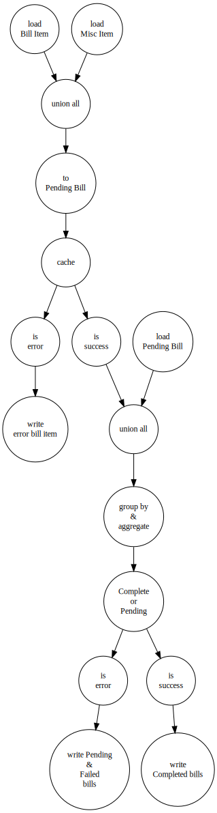

# Billing Settlement Engine 

## IDE Setup
* IntelliJ Community Edition or better
* Maven 3.3+
* settings.xml using WP's Nexus as maven repo

## IntelliJ Plugins
* Lombok plugin installed
* SonarLint plugin
  * Configure it against the WP sonarqube server to get the rules applied locally.
* Code Style Formatter: https://github.com/google/styleguide/blob/gh-pages/intellij-java-google-style.xml

## Database setup
You need an oracle database in order to build the project please check the 
[wiki page](https://github.devops.worldpay.local/NAP/pricing-calculation-engine/wiki/Database-setup).

## Building
You can skip tests locally passing `-Dskip.unit.tests=true` to maven.  
You can skip dependency checks passing: `-Denforcer.skip=true`  
e.g. `mvn package -Dskip.unit.tests=true -Denforcer.skip=true` will build a package without running tests or dependency checks

## Diagram

